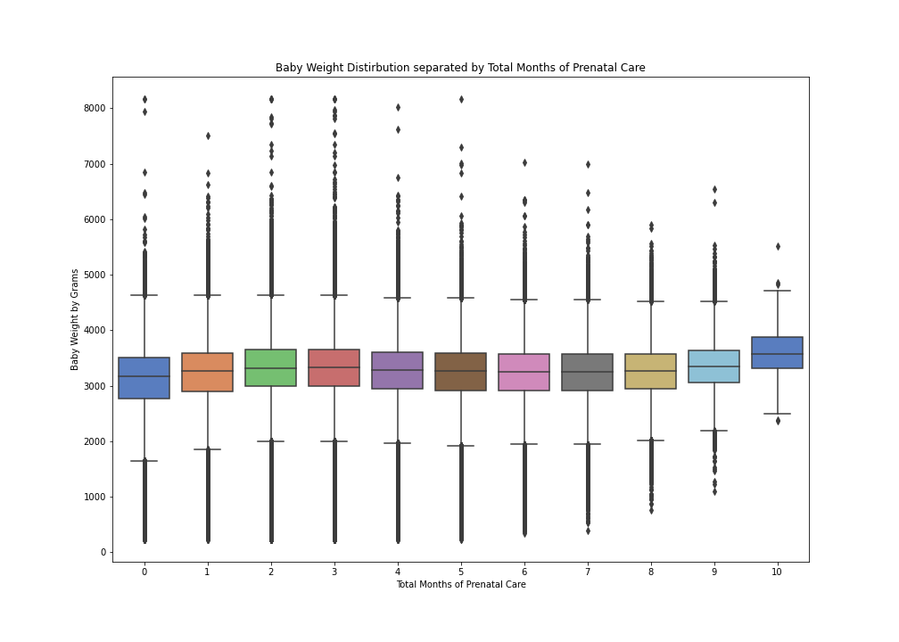
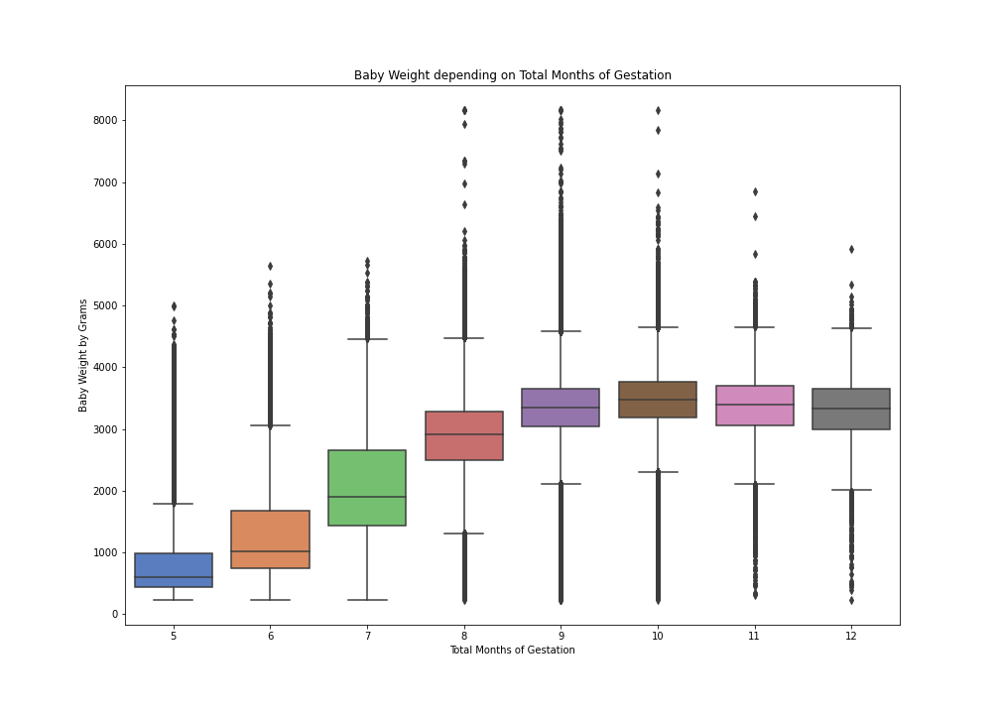
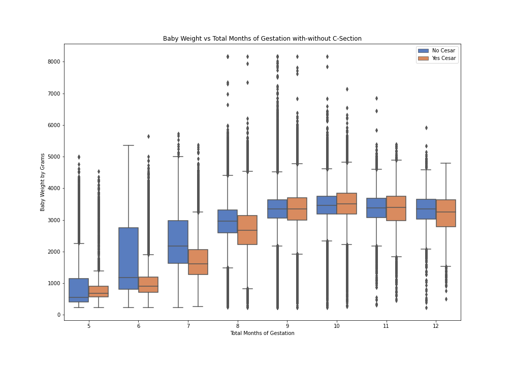

# Mod2 Project: US_Births_2018
##### created by Albert Um DS Flatiron Cohort 06/22/20 
---
The dataset can be accessed from kaggle:  https://www.kaggle.com/des137/us-births-2018   Credit to Amol Deskmukh for cleaning the dataset from   https://www.cdc.gov/nchs/data_access/vitalstatsonline.htm#Tools  
Look at 'US_Birth_Columns' for column description pulled from  https://www.cdc.gov/nchs/data_access/vitalstatsonline.htm#Tools
## Introduction
For this dataset, 'DBWT'(Birth Weight) will be my target variable. Under weight babies can be healthy even though they are small, however, low-weight babies can have some serious problems. I'll try to create a best fit-line and interpret some of its coefficients. The dataset contains around 3.8 million rows and 55 columns.

## Files on this Repo
'US_Birth_Columns': description of columns and what each value means 
'Final.ipynb': Lengthy notebook describing my work 
'/Images': Folder containing plotted images

## Acknowledge the differences

Here is a plot of 2 distributions of baby weights overlaying each other. The blue represents the mothers who smoked daily before inception and the orange are those who have not. Although they seem to be closely aligned, they are statistically different. 
P-value < 0.05

Here is a boxplot of the distributions of baby weights separated by the number of total months the mother got checkups. The 1 on the x axis represents one month of checkups, 2 as 2 months of checkups, and on. Although these groups look pretty similiar, they're not!
P-value < 0.05

Here we have another boxplot of baby weights separated by the "length of pregnancy"(in months). Please note the possible errors having gestation periods of 12 months. The "pregnancy_length" was feature engineered by subtracting the Month,Year of last Normal Menses Month[DLMP_MM, DLPMP_YY] from the Month,Year of the baby born[DOB_MM, DOB_YY]. "pregnancy_length" represents a crude attempt on the mothers gestation period.   
With that note set aside, it's pretty clear to see that there is a difference of distributions even without running a test. Interestingly, we can kind of draw a line that might best fit this. And it looks like the longer the gestation period, the heavier the baby gets. 
But what happens if we make it a little bit more complex.

Here we have a the similar boxplot of baby weights separated by the length of pregnancy. In addition, each month has two boxplots. The orange boxes represent the cases where mother had to undergo C-section and the blue boxes are those that did not. 
It's kind of tough to draw a best fit line to accurately represent this. However with the power of computers, I can try to create a best fit-line.

## Interesting Coefficients: 
My final model had a R2 score 0.38 with 71 features. I'll break down some coefficients I found interesting. 
(ex: **feature**:coefficient) 
**smoked_None**: 31.81 
If the mother has never smoked the model increased the expected weight by 31 grams. It's very possible that the mothers who were smokers before could have had other health conditions.  

**PRECARE**: 429.28(+492.28/sd(standard deviation))
For every 1.5 months of checkups, the model increased the expected weight by 429 grams. Pre-natal care is pretty expensive. May it has something to do with class and income back grounds. 

**RDMETH_REC_3**: -1389.83 
If the mother had to receive Cesearean Section, the model subtracted 1400 grams. This finding can als obe interepreted as... the mothers that required C-section could be due to other baby complications. 

## Key Insights
Calculating a human baby's weight can be very complex. Nonetheless, we can still try to draw some understanding of what may determine a babies weight.  
In a simple world, everything would be normal and even. But unfortunately, many things aren't. Looking back to the coefficients of Prenatal Care, why does the number of monthly checkups determine baby weight? Is prenatal care easily avaiable for all classes or is there some economic hurdle that is creating this difference? This model isn't supposed to create predictions, it's to address findings so that we can eventually break predictors.
