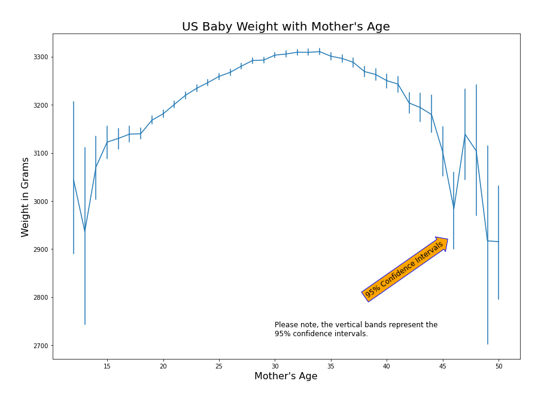

# Understanding Baby Weight Pre-Birth

Albert Um DS Flatiron Cohort 06/22/20 

# Project
I am looking to extract coefficients of independent variables that can explain baby weight(pre-birth). Coefficients will be extracted using linear regression with regularization. 

## Structure of Repository
- 'US_Birth_Columns': description of columns and what each value means 
- 'Final.ipynb': Lengthy notebook describing my work 
- 'Adjustments.ipynb': adding notebooks post graduation  
- '/Images': Folder containing plotted images
- 'README.md'

# Business Case
1. Target/Identifying Stakeholders
    - To whom does it matter?
        1. Hospitals: Under weight babies can be healthy even though they are small, however, low-weight babies can have serious problems.
        2. Expecting Mothers: Looking at 
2. Focusing on coefficients that have a large impact in determining weight

# Data
The csv data can be downloaded from [here](http://www.nber.org/data/vital-statistics-natality-data.html). It has been compiled by the National Center for Health Statistics(NCHS) National Vital Statistics System division. The 2018 Natality dataset contains 240 columns with 3.8 million rows. I have reduced the columns to 79 columns and I random sampled 750,000 rows for this project.

# Visualizations

The distribution of the dependant variable, baby weight. There seems to be a slight left skew as the median is greater than the mean. 

The vertical lines represent the 95% confidence intervals.

In general, if birth is before the completion of the 37th week than it can be considered "pre-term". Week 37 to Week 42 can be considered normal and births after week 42 can be considered "post-term".

# Model Evaluation
I first split the dataset using sklearn's train_test_split. The X_test will be used to evaluate the model.  
In order to mechanically choose which variables to explain, I decided to fit a gradient boosted decision tree and plot feature importance.  
To do this, I needed to split AGAIN the X_train and y_train to X_train_lgbm, X_val_lgbm, y_train_lgbm, and y_val_lgbm.  
The parameters were hyper-tuned using a random-search like package called 'optuna'. The top 20 variables from feature importance was then showcased for explanation of coefficients.

To extract coefficients, I'll use linear regression with l1 regularization. I chose lasso because it acts as feature selection by punishing certain coefficients to zero. 

# Results

## Key Insights
Calculating a human baby's weight can be very complex. Nonetheless, we can still try to draw some understanding of what may determine a babies weight.  
In a simple world, everything would be normal and even. But unfortunately, many things aren't. Looking back to the coefficients of Prenatal Care, why does the number of monthly checkups determine baby weight? Is prenatal care easily avaiable for all classes or is there some economic hurdle that is creating this difference? This model isn't supposed to create predictions, it's to address findings so that we can eventually break predictors.
