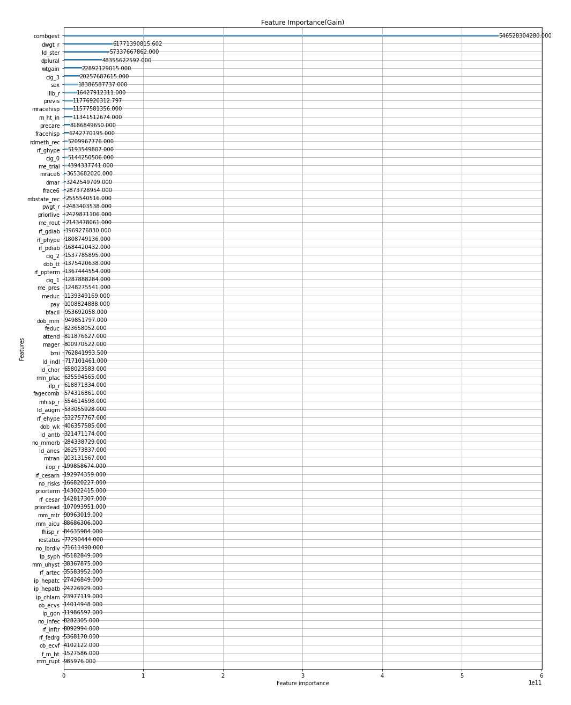
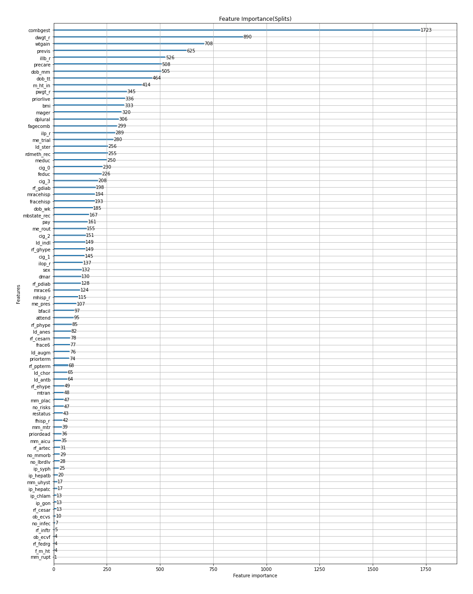
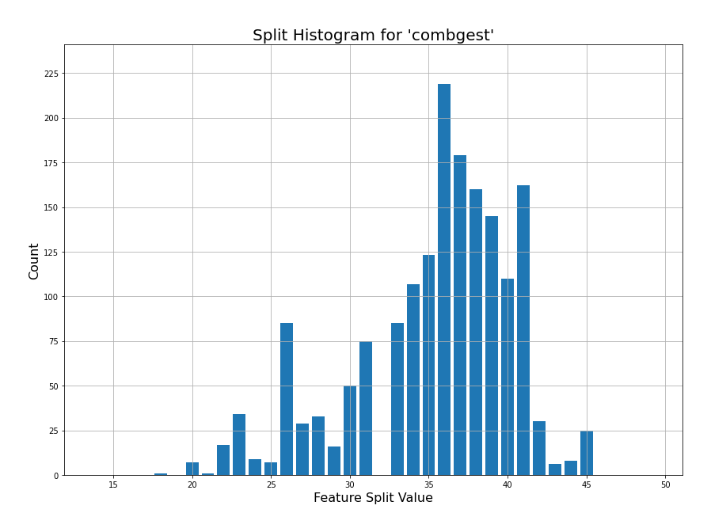
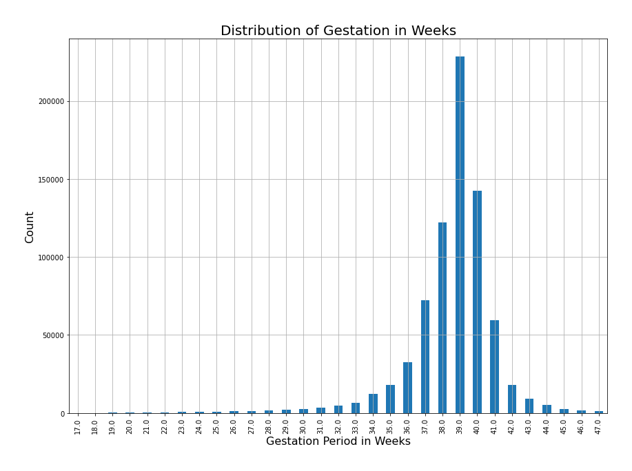

# Understanding Baby Weight Pre-Birth

Albert Um DS Flatiron Cohort 06/22/20 

# Project
I am looking to extract coefficients of independent variables that can explain baby weight(pre-birth). Coefficients will be extracted using linear regression with regularization. 

## Structure of Repository
Please run the notebooks in this order: 
Exploratory_Visualizations.ipynb &#8594; Model_Evaluation.ipynb &#8594; lgbm_regressor.ipynb
- 'US_Birth_Columns': description of columns and what each value means 
- 'Exploratory_Visualizations.ipynb': notebook for visualizations 
- 'Final.ipynb': Lengthy notebook describing my work 
- 'Model_Evaluation.ipynb': notebook for lasso regression  
- 'lgbm_regressor.ipynb': notebook for gbdt  
- '/Images': Folder containing plotted images
- 'README.md'

# Business Case
1. Target/Identifying Stakeholders
    - To whom does it matter?
        1. Hospitals: Under weight babies can be healthy even though they are small, however, low-weight babies can have serious problems.
        2. Expecting Mothers: Looking at 
2. Focusing on coefficients that have a large impact in determining weight

# Data
The csv data can be downloaded from [here](http://www.nber.org/data/vital-statistics-natality-data.html). It has been compiled by the National Center for Health Statistics(NCHS) National Vital Statistics System division. The 2018 Natality dataset contains 240 columns with 3.8 million rows. I have reduced the columns to 79 columns and I random sampled 750,000 rows for this project.

# Visualizations

The distribution of the dependant variable, baby weight. There seems to be a slight left skew as the median is greater than the mean. 

The vertical lines represent the 95% confidence intervals.

In general, if birth is before the completion of the 37th week than it can be considered "pre-term". Week 37 to Week 42 can be considered normal and births after week 42 can be considered "post-term".

# Model Evaluation/Results
I will use R2 as my metric, as I'm going for a interpretability approach to baby weight. I first split the dataset using sklearn's train_test_split. The X_test will be used to evaluate the model.  

## Dummy Regressor
I need a baseline when trying to evaluate my model. The dummy regressor will predict the baby weight mean across all instances.

R2 of Dummy: 0.000
RMSE of Dummy: 587.60

## Lasso
To extract coefficients, I'll use linear regression with l1 regularization. I chose lasso because it acts as feature selection by punishing certain coefficients to zero.
R2 of LassoCV: 0.462
RMSE of LassoCV: 430.91

The most significant feature was the gestation period. For every one std move of gestation (2.5 weeks), equates to baby weight increase by 227 grams. Considering the "normal" pregnancy length is 38 weeks, this feature alone can explain the weight of the baby.

Also, please note mothers who are white have a positive coefficient value while mothers who are black have negative coefficients.

## Gradient Boosted Decision Tree
Due to the size of the dataset, I was unable to successfully create interactions of features. I will now implement a gradient boosted decision tree because decision trees are inherent feature engineers. The boosted decision tree takes what was learned from the previous model to further tune its predictors. In short,the gbdt results can be interpretted as a linear combination of all the trees. 
For this project, I lowered, the tree depth to 4 for interpretability.

R2 of gbdt: 0.521
RMSE of gbdt: 407.66

Image of the first tree:

The model takes the results from the first tree and builds on top of it creating the second tree, then third, until the loss (in this case rmse) can no longer be lowered on the validation set.

Image of the last tree:

Because it's exhaustive to look at more than 1000 trees to come to a conclusion. I can just look at the feature importance of gain and splits. Gain represents the information gain after splitting and splits represent the number of times a feature was split.

 

Combgest (Combined Gestation Period) is the most important feature for both gains and splits. It will be interesting to look at the number of occurances the splits took place next.

Surprisingly, the most occurances of splits for 'combgest' happened between 36 weeks to 41 weeks. It seems in order to accurately predict, the splits occurred mostly on week 36. Further study needs to be done onto why week 36 is so important.  

Distribution Plot for 'combgest'

## Conclusions
Calculating a human baby's weight can be very complex. Nonetheless, we can still try to draw some understanding of what may determine a babies weight.  
For this project, gestation period had the most impact on determining baby weight. More over, an interaction with pregnancy length can better determine baby weight. For further studies, I will be looking into these specific splits on week 36 to week 41 to better understand baby weight.
