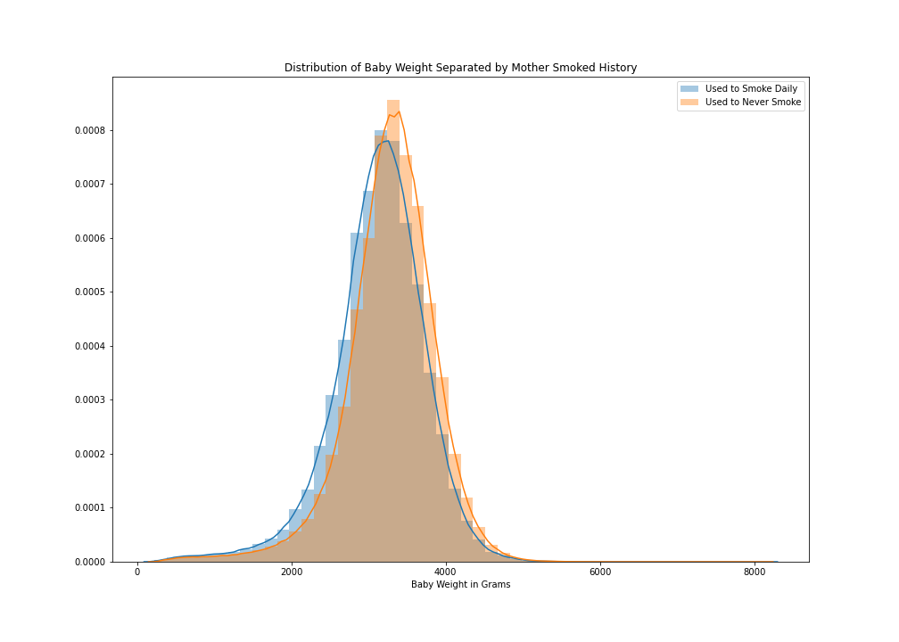

# Mod2 Project: US_Births_2018
##### created by Albert Um DS Flatiron Cohort 06/22/20 
---
The dataset can be accessed from kaggle:  https://www.kaggle.com/des137/us-births-2018   Credit to Amol Deskmukh for cleaning the dataset from   https://www.cdc.gov/nchs/data_access/vitalstatsonline.htm#Tools  
Look at 'US_Birth_Columns' for column description pulled from  https://www.cdc.gov/nchs/data_access/vitalstatsonline.htm#Tools
## Introduction
For this dataset, 'DBWT'(Birth Weight) will be my target variable. Under weight babies can be healthy even though they are small, however, low-weight babies can have some serious problems. I'll try to create a best fit-line and interpret some of its coefficients.

## Files on this Repo
'US_Birth_Columns': description of columns and what each value means 
'Final.ipynb': Lengthy notebook describing my work 
'/Images': Folder containing plotted images

## Acknowledge the differences

Here is a plot of 2 distributions of baby weights overlaying each other. The blue represents the mothers who smoked daily before inception and the orange are those who have not. Although they seem to be closely aligned, they are statistically different. 
P-value < 0.05

Here is a boxplot of the distributions of baby weights separated by the number of total months the mother got checkups. The 1 on the x axis represents one month of checkups, 2 as 2 months of checkups, and on. Although these groups look pretty similiar, they're not!
P-value < 0.05

Here we have anothe rboxplot of baby weights eparated by the "length of pregnancy"(in months). It's pretty clear to see that there is a difference of distributions even without running a test. Interestingly, we can kind of draw a line that might best fit this. And it looks like the longer the gestation period, the heavier the baby gets. 
But what happens if we make it a little bit more complex.

Here we have a the similar boxplot of baby weights separated by the length of pregnancy. In addition, each month has two boxplots. The orange boxes represent the cases where mother had to undergo C-section and the blue boxes are those that did not. 
It's kind of tough to draw a best fit line to accurately represent this. However with the power of computers, I can try to create a best fit-line.

## Key Insights
The purpose of this project is to find some variables that can best explain the variances of the baby birth weight. In a normal world, there should be no differences among baby weights regardless of features. However, we don't live in a normal world. Creating a best-fit line and interpretting its coefficients can bring light into why there might be such differences. 
Calculating a human baby's weight can be very complex. Nonetheless, we can still try to draw some understanding of what may determine a babies weight.
